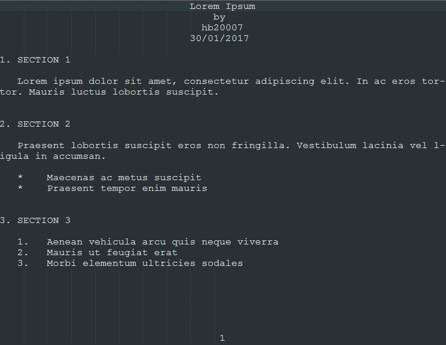

#  miniTeX

> Simple, didactic TeX

miniTeX is a simple text formatting language intended to illustrate the basics of languages such as TeX. This repository contains the code for the compiler of the language. The grammar can be found in `Notes.md`.


## 1. Usage example

**Example source file:**


**Corresponding output file:**



## 2. Language

My code is written in **C11**. I have made use of the _Flex_ and _Bison_ tools for lexical analysis and parser generation.

## 3. Installation instructions

The instructions below are for the GCC C compiler.
	  
The example input file is `ExampleSourceFile.txt` and the output file is `output1.txt`.

It is assumed that environment variables for make, Flex, Bison and GCC are configured correctly and that the programs can be called from within the command line.

**Linux & macOS:**

Use the shell to navigate to the miniTeX directory then execute the following commands...

```sh
make # generate miniTeX.exe
make clean # delete auto-generated files
miniTeX ExampleSourceFile.txt output.txt
```

**Windows:**

The makefile runs shell commands. This is not supported by Microsoft's "nmake" nor by MinGW's make. Make sure that you use MSYS's make instead.

( To download MSYS visit http://www.mingw.org/wiki/MSYS )

Open cmd and navigate to the directory with the miniTeX files then execute the following commands...

```sh
      make # generate miniTeX.exe
	  make clean # delete auto-generated files
  	  miniTeX ExampleSourceFile.txt output.txt
```

## 4. Release history

* 1.1
    * Made miniTeX cross-platform
* 1.0
    * The first proper release

## 5. Meta

H. Z. Sababa &mdash; hb20007 &mdash; hzsababa@outlook.com

Distributed under the MIT license. See `LICENSE.md` for more information.

https://github.com/hb20007