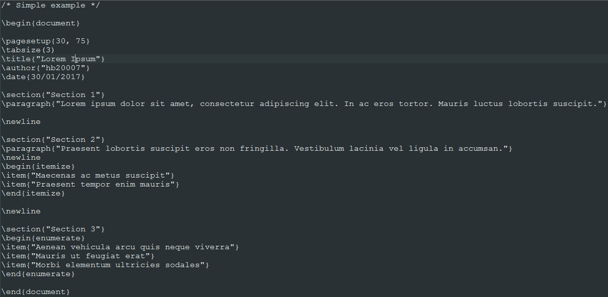
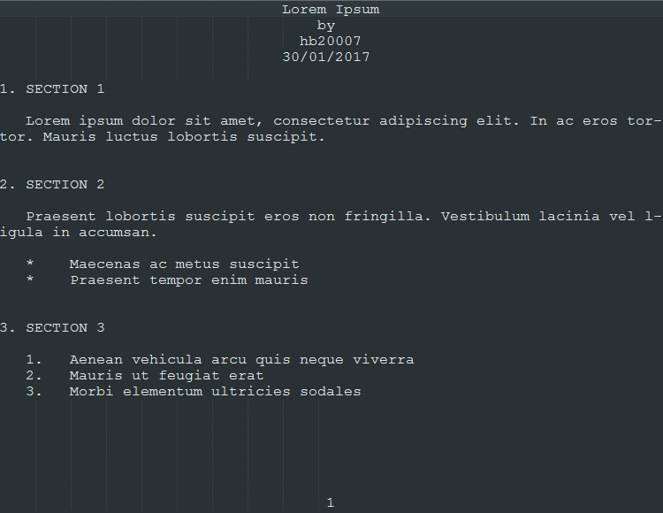

#  miniTeX

[](https://github.com/hb20007/cpp-programs/blob/master/LICENSE.md)
[](https://github.com/hb20007/miniTeX/releases/latest)

> Simple, didactic TeX

miniTeX is a simple text formatting language that illustrates the basics of languages like TeX. This repository contains the code for the miniTeX compiler. The grammar can be found in [`notes.md`](/notes.md).

## 1. Usage example

**Example source file:**



**Corresponding output file:**



## 2. Language

My code is written in **C**. I have use _Flex_ and _Bison_ for lexical analysis and parser generation.

## 3. Installation instructions

The instructions below are for the GCC C compiler.

The example input file is `example_source_file.txt`, and the output file is `output1.txt`.

It is assumed that environment variables for `make`, Flex, Bison, and GCC are correctly configured and that the programs can be called from the command line.

**Linux & macOS:**

Use the shell to navigate to the miniTeX directory, then execute the following commands:

```sh
make # generate miniTeX.exe
make clean # delete auto-generated files
miniTeX ExampleSourceFile.txt output.txt
```

**Windows:**

The makefile runs shell commands. This is not supported by Microsoft’s `nmake` nor by MinGW’s `make`. Make sure that you use MSYS’s `make` instead.

(To download MSYS, visit <https://www.msys2.org/>.)

Open `cmd` and navigate to the directory containing the miniTeX files. Then, execute the following commands:

```sh
make # generate miniTeX.exe
make clean # delete auto-generated files
miniTeX ExampleSourceFile.txt output.txt
```

## 4. Release history

- 1.1
  - Made miniTeX cross-platform
- 1.0
  - The first working release
